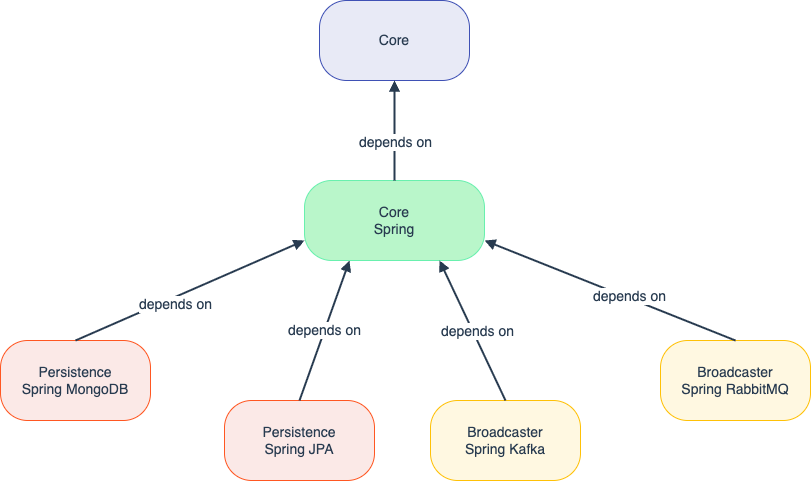

# Naryo

Naryo is a lightweight, highly modular and flexible framework for capturing and processing events from Distributed
Ledger Technology (DLT) networks. This project is based on [Eventeum](https://github.com/eventeum/eventeum) and aims to
provide a user-friendly, resilient event listener that supports a wide range of DLT protocols. It is designed to
simplify event handling by reducing the complexity of developing, deploying, and maintaining application logic for
capturing, processing, and broadcasting events, all while meeting the security and performance requirements of
enterprise-grade systems.

> **Note**: Naryo is a work in progress (WIP). The documentation is being actively updated. Please be aware that
> some features might not be fully implemented, and certain parts of the documentation may not reflect the latest
> changes.

## ⛑️ How it works

Naryo configures filters that are used to determine which events to capture and process. These filters can be based on
smart contract events, transaction fields, or any other criteria you may need to define. Naryo then connects to a DLT
node and captures events that match the configured filters. These events are then processed and broadcast to the
specified recipients, such as endpoints, queues or databases.

## 🚀 Features

* Supports multiple DLT protocols, including Ethereum, Hedera, and others.
* Supports Ethereum RPC and Hedera Mirror nodes.
* Supports multiple broadcasting mechanisms, including Kafka, RabbitMQ, and HTTP REST API.
* The core module is framework-agnostic, allowing you to use it with any framework of your choice.
* Provides a simple and configurable interface for defining event filters.
* Highly configurable and extensible, allowing you to easily add support for new DLT protocols and broadcasting
  mechanisms.
* Supports multiple event types, including contract events, transaction events, and block events.
* Supports multiple persistent storage options, including MongoDB and SQL databases.
* Spring Boot integration, making it easy to set up and run Naryo in a Spring Boot application.
* Fully asynchronous, allowing you to capture events in the background without blocking the main thread.
* Supports multi-instance mode, allowing you to capture events from multiple DLT networks in parallel.
* Supports dynamic configuration, allowing you to add and remove event filters or broadcast recipients at runtime.
* Supports event confirmation, ensuring that events are processed once block confirmation is reached.
* Supports event invalidation, allowing you to invalidate events that have not been processed for a certain number of
  blocks.

## 🌳 Architecture

Naryo is a framework that provides a set of modules. The core module is responsible for capturing and processing events
from a DLT network, while the rest of the modules extend the functionality of Naryo. The following modules are
currently available:

* `core`: The core module, responsible for capturing and processing events from a DLT network.
* `core-spring`: A Spring Boot integration for the core module.
* `persistence-spring-mongodb`: A Spring Boot integration for MongoDB persistence.
* `persistence-spring-jpa`: A Spring Boot integration for JPA persistence.
* `broadcaster-spring-kafka`: A Spring Boot integration for Kafka broadcasting.
* `broadcaster-spring-rabbitmq`: A Spring Boot integration for RabbitMQ broadcasting.

## 📚 Tutorials

The following tutorials will guide you through the process of setting up Naryo and using it to capture and process
events from a DLT network:

- [Start Naryo with Besu](./docs/tutorials/start_naryo_with_besu.md)
- [Start Naryo with Hedera](./docs/tutorials/start_naryo_with_hedera.md)

## 📝 Documentation

- [Getting started](./docs/getting_started.md)
- [Configuration](./docs/configuration.md)
- [Usage](./docs/usage.md)
- [Metrics](./docs/metrics.md)
- [Known Caveats / Issues](./docs/issues.md)

## 🙌 Contributing

We welcome contributions from the community to improve and expand this project. Whether it’s fixing bugs, improving
documentation, or proposing new features, your input is appreciated!

To contribute:

1. **Fork** the repository and create your branch from `main`.
2. Make your changes in a well-scoped branch (e.g. `fix/issue-name`, `feature/new-capability`).
3. Ensure code is properly tested and documented.
4. Open a **Pull Request** with a clear description of your changes and link any relevant issues.

Please follow the existing code style and conventions. If in doubt, feel free to open a discussion before you start
working on something major.

## ©️ License

This project is licensed under the [Apache License, Version 2.0](LICENSE).

