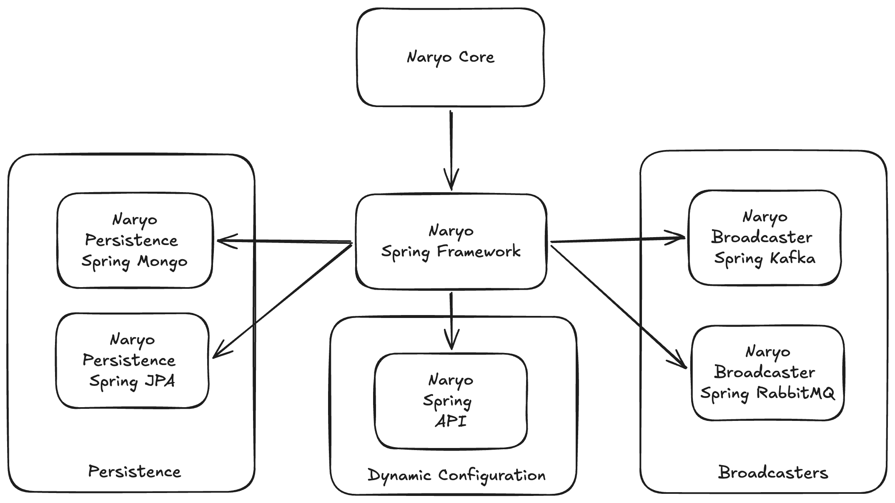
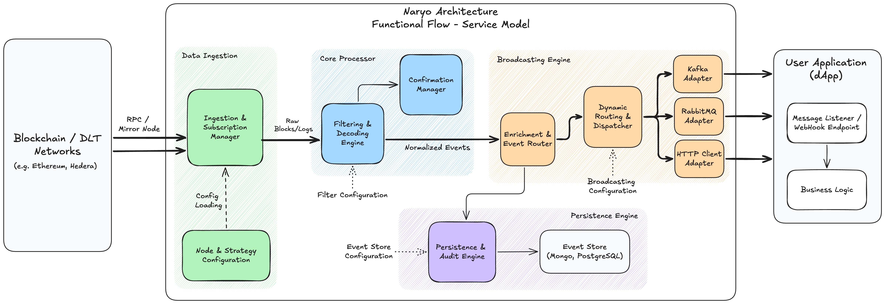

# Architecture

This document provides a high-level overview of Naryo’s architecture and the main runtime components.

## Layers and modules

- **Core**: framework-agnostic runtime, domain, and application services for connecting to nodes, applying filters, decoding
  data, and producing normalized events.
- **Spring integration**: autoconfiguration, YAML parsing, and lifecycle wiring for convenient usage in Spring Boot apps.
- **Persistence integrations**: MongoDB and JPA/SQL modules to store events and related context.
- **Broadcasters**: pluggable outputs (HTTP, Kafka, RabbitMQ) to deliver events to your systems.
- **API**: RESTful endpoints for configuring and managing Naryo.

## Functional Data flow

1. **Data Ingestion**: The **Ingestion & Subscription Manager** connects to DLT nodes (Ethereum RPC, Hedera Mirror)
   using
   specific **Node & Strategy Configurations**. It reads raw blocks, transactions, and logs based on the defined polling
   or
   pub/sub strategy.
2. **Core Processing**:
    1. **Filtering & Decoding**: The engine selects relevant data and decodes contract events (ABI-based) into
       strongly typed parameters.
    2. **Confirmation Management**: Parallel to decoding, this component tracks block confirmations and handles reorgs,
       ensuring event validity.
3. **Enrichment & Routing**: Normalized events are enriched with metadata (revert reason, timestamps). The Enrichment &
   Event Router then prepares the data for its two possible destinations: persistence or broadcasting.
4. **Broadcasting**: The Dynamic Routing & Dispatcher sends the enriched events to one or multiple destinations. It uses
   specific Adapters (Kafka, RabbitMQ, HTTP) to deliver the data to the final User Application (dApp).
5. **Persistence (Optional)**: If configured, the Persistence & Audit Engine saves the event into an Event Store (
   PostgreSQL, MongoDB), allowing for future queries, historical replay, and system reliability.

## Deployment models

- **Embedded library**: include Naryo in your application (Spring Boot or manual wiring).
- **Reference server**: run the provided Docker image that embeds Naryo with Spring Boot and file/database configuration.

For configuration details see the [configuration guide](configuration/index.md).
