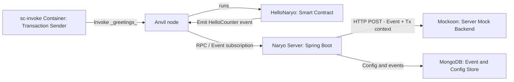

# 🚀 Naryo Quickstart

Naryo is essentially a multichain event listner, that catches events from one or more DLT nodes, and broadcast them to one or more destinations (backend endopoints, queues, or databases).

This guide explains how to configure, deploy and use Naryo in 2 simple steps.

## 🧰 Requirements

* Docker & Docker Compose
* Git

## 📦Step 1: Deployment of local environment

Download the repo and setup the example environment:

```bash
  git clone https://github.com/LF-Decentralized-Trust-labs/Naryo naryo
  cd naryo/examples/quickstart
  docker compose up -d anvil sc-deployer mock-http mongodb naryo-server
```

You just deployed the following components:

* An Anvil node (local Ethereum dev node)
* A _HelloNaryo.sol_ Smart Contract deployed at the node. The contract has one _greetings()_ function, that emits a _HelloCounter(uint256)_ event.
* A Mockoon server, which simulates a backend application that wants to receive the events emitted by the contract.
* A MongoDB database, where catched events are also stored. (Using a database is optional, but recommeneded for better auditability and resiliency).
* A Naryo Server that catches the events from Anvil, sends them to the Mockoon server, and stores it in the MongoDB database.
  
**To use Naryo, you must deploy a backend service that imports at least the [Naryo core module](../configuration/configuration-core.md), and pass the Naryo configuration to it**.

The Docker container of the Naryo Server you just deployed, is a reference implementation of such a backend.

When using the reference Docker image of the Naryo server, you can configure Naryo through an _application.yml_ file. This is because the container is running a SpringBoot application, which normally uses such kind of file-based configurations.

> You can also configure Naryo from a database, instead of an _application.yml_ file. Learn how to configure Naryo using a [MongoDB](../configuration/configuration-mongo.md) or a [JPA-supported database](../configuration/configuration-jpa.md).

> You can modify Naryo's configuration on runtime through a Rest API. Learn more in the [Configuration API documentation](../configuration/configuration-api.md).

Take a look at the [_application.yml_](../../examples/quickstart/application.yml) file used in this quickstart. You will see the parameters for:
1. The connection to the Anvil node
2. The connection to the mock http server
3. The events filters for the deployed contract

Below a fragment of the file.

```yaml
naryo:
  nodes:
    - id: eadc75b2-4217-4018-95af-f67c13058976
      name: anvil
      type: ETHEREUM
      connection:
        type: HTTP
        endpoint:
          url: http://anvil:8545
      subscription:
        method: POLL
        interval: 1s

  broadcasting:
    configuration: #the server that will receive the events
      - id: cd1bec0d-2998-46bc-828f-94459d42c17a
        type: HTTP #the destination is an HTTP server. Other supported types are KAFKA and RABBITMQ.
        endpoint:
          url: http://mock-http:7070
    broadcasters:
      - id: cd1bec0d-2998-46bc-828f-94459d43c17b
        configurationId: cd1bec0d-2998-46bc-828f-94459d42c17a #the id of the destination configuration
        target: #parameters to define what should be sent and to which specific route within the destination
          type: FILTER #only send events that are captured by a specific filter
          filterId: a5605668-7a88-4e5c-b4ee-4a8417b7184d #the specific filter id (see line 32)
          destinations:
            - /events #the specific endpoint whitin the HTTP server      
  filters:
    - id: a5605668-7a88-4e5c-b4ee-4a8417b7184d
      name: "my-filter"
      nodeId: eadc75b2-4217-4018-95af-f67c13058976 #the id of the configured node (see line 6)
      type: "EVENT"
      scope: "CONTRACT" 
      specification:
        signature: "HelloCounter(uint256)"
      address: ${CONTRACT_ADDRESS}
```
> In your projects, you would replace the values of the *.yml* file with your own context (e.g. your RPC URL; your own HTTP endpoint; among others).

> Naryo also supports more [DLT protocols](../configuration/configuration-core.md) and [broadcast destinations](../broadcasting/index.md). 


## 🎉 Step 2: Invoke the contract and see the logs

Open a terminal to see the Mockoon server logs:
```bash
 docker logs -ft mock-http
```

In another terminal, invoke the contract using a helper _sc-invoke_ container:
> Make sure you are in the naryo/examples/quickstart folder.

```bash
 docker compose up sc-invoke
```



Every time you invoke the _HelloNaryo_ contract, Naryo will catch the _HelloCounter_ event, and send it to the Mockoon server, alongside some context information, like some transaction data. The Mockoon server will display a verbose log with the details of the received request. Below is an example of the data Naryo sends to the mocked backend (the request body might be stringified in the actual logs):

```json
{
    "eventType": "CONTRACT",
    "nodeId": "eadc75b2-4217-4018-95af-f67c13058976",
    "name": {
        "value": "HelloCounter"
    },
    "parameters": [
        {
            "type": "UINT",
            "indexed": false,
            "position": 0,
            "value": 1
        }
    ],
    "transactionHash": "0x1b1540ee118399ea6778789d847502cda0f3e71a671e313a181fe69c768f174d",
    "logIndex": 0,
    "blockNumber": 2,
    "blockHash": "0xc39d5ad2f53a4cdbc53a65b1160ff248e448c9124736006c4947f8f889239af7",
    "contractAddress": "0x5fbdb2315678afecb367f032d93f642f64180aa3",
    "sender": "0xf39fd6e51aad88f6f4ce6ab8827279cfffb92266",
    "timestamp": 1769786709,
    "status": "UNCONFIRMED",
    "key": "0x1b1540ee118399ea6778789d847502cda0f3e71a671e313a181fe69c768f174d:0"
}
```

> You can also see the event data if you query the MongoDB database.

## 👉 Conclusion and Next steps
In this quickstart, you have seen how easy is to configure and setup Naryo. As next steps, you may go through the [Documentation](../). Once you have a better understanding of how Naryo works, feel free to copy the example configurations in the [_examples_ folder ](../../examples/) and tailor it to your needs. Examples include Naryo configurations snippets to use Naryo with databases, multiple nodes, multiple event filters, fine-tuned performance, among many others.

>The *examples* documentation is WIP. Check regularly for updates.

You may also learn how to [get started with Naryo without Docker](../getting_started.md), or follow our tutorials about using Naryo [with Besu](./start_naryo_with_besu.md) or [with Hedera (Hiero)](./start_naryo_with_hedera.md).
