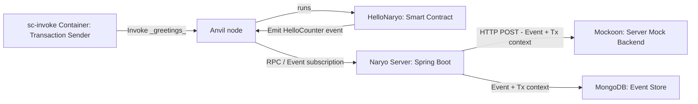

# Naryo Quickstart: Ethereum (Besu/Anvil)

This guide will show you how to quickly set up Naryo to capture events from an Ethereum-compatible blockchain (like Besu or Anvil) and broadcast them to a mock backend. You'll see Naryo in action in just a few simple steps!

## Requirements

*   Docker & Docker Compose
*   Git

## Step 1: Deploy Your Local Environment

Clone the Naryo repository and start the example environment using Docker Compose:

```bash
git clone https://github.com/LF-Decentralized-Trust-labs/Naryo naryo
cd naryo/examples/quickstart
docker compose up -d anvil sc-deployer mock-http mongodb naryo-server
```

This command deploys the following components:

*   **Anvil Node**: A local Ethereum development node.
*   **`HelloNaryo.sol` Smart Contract**: A simple contract deployed on Anvil, featuring a `greetings()` function that emits a `HelloCounter(uint256)` event.
*   **Mockoon Server**: Simulates a backend application ready to receive events from Naryo.
*   **MongoDB Database**: An optional (but recommended) database for storing captured events, enhancing auditability and resiliency.
*   **Naryo Server**: The core of this quickstart. It connects to the Anvil node, captures `HelloCounter` events, sends them to the Mockoon server, and persists them in MongoDB.

> The Naryo Server deployed here is a reference implementation of a Spring Boot application running Naryo. It uses an `application.yml` file for configuration. You can also configure Naryo dynamically from a database (e.g., [MongoDB](../configuration/persistence/configuration-mongo.md) or [JPA-supported database](../configuration/persistence/configuration-jpa.md)) or manage it via the [Configuration API](../configuration/api/configuration-api.md).

For a detailed look at the configuration, inspect the [`application.yml`](../../examples/quickstart/application.yml) file used in this quickstart. Key sections include:

*   **Node Connection**: Defines how Naryo connects to the Anvil node.
*   **Broadcasting Setup**: Configures the Mockoon HTTP server as an event destination.
*   **Event Filter**: Specifies how Naryo identifies and captures the `HelloCounter(uint256)` event from the deployed contract.

## Step 2: Invoke the Contract and Observe Events

1.  **Monitor Mockoon Logs**: Open a new terminal and observe the events Naryo sends to your mock backend:

    ```bash
    docker logs -ft mock-http
    ```

2.  **Invoke the Smart Contract**: In another terminal, navigate to the `naryo/examples/quickstart` directory and trigger the `greetings()` function:

    ```bash
    docker compose up sc-invoke
    ```

    Each invocation will cause the `HelloNaryo` contract to emit a `HelloCounter` event, which Naryo will capture and forward.


```mermaid
flowchart LR
    %% Nodes / Infrastructure
    Anvil[Anvil node]
    Contract[HelloNaryo: Smart Contract]
    Naryo[Naryo Server: Spring Boot]
    Mockoon[Mockoon: Server Mock Backend]
    Invoke[sc-invoke Container: Transaction Sender]
    MongoDB[MongoDB: Event Store]

    %% Deployment relationships
    Anvil -->|runs| Contract

    %% Runtime interactions
    Invoke -->|Invoke _greetings_| Anvil
    Contract -->|Emit HelloCounter event| Anvil

    %% Event listening
    Anvil -->|RPC / Event subscription| Naryo

    %% Broadcasting
    Naryo -->|HTTP POST - Event + Tx context| Mockoon

    %% Storing data
    Naryo -->|Event + Tx context| MongoDB
```

The Mockoon server logs will display the event data received from Naryo. The event payload will look similar to this:

```json
{
  "eventType": "CONTRACT",
  "nodeId": "eadc75b2-4217-4018-95af-f67c13058976",
  "name": {
    "value": "HelloCounter"
  },
  "parameters": [
    {
      "type": "UINT",
      "indexed": false,
      "position": 0,
      "value": 1
    }
  ],
  "transactionHash": "0x1b1540ee118399ea6778789d847502cda0f3e71a671e313a181fe69c768f174d",
  "logIndex": 0,
  "blockNumber": 2,
  "blockHash": "0xc39d5ad2f53a4cdbc53a65b1160ff248e448c9124736006c4947f8f889239af7",
  "contractAddress": "0x5fbdb2315678afecb367f032d93f642f64180aa3",
  "sender": "0xf39fd6e51aad88f6f4ce6ab8827279cfffb92266",
  "timestamp": 1769786709,
  "status": "UNCONFIRMED",
  "key": "0x1b1540ee118399ea6778789d847502cda0f3e71a671e313a181fe69c768f174d:0"
}
```

> You can also verify the event data by querying the MongoDB database directly.

## Conclusion & Next Steps

Congratulations! You've successfully deployed Naryo and seen it capture and broadcast blockchain events.

Ready for more?

*   **[Explore the Documentation](../../README.md)**: Dive deeper into Naryo's capabilities, from advanced filtering to custom broadcasting.
*   **[Discover More Examples](../../examples/)**: Our `examples` folder contains various Naryo configurations, demonstrating usage with different databases, multiple nodes, fine-tuned performance, and more.
*   **[Advanced Setup Options](../getting_started.md)**: Learn how to integrate Naryo into your existing Java/Spring Boot applications without Docker.
*   **[Hedera Quickstart](./naryo_quickstart_hedera.md)**: Explore Naryo's abilities with the Hedera network.
*   **[Besu Advanced Setup](./start_naryo_with_besu.md)**: Detailed guide for setting up Naryo with a Besu node.
