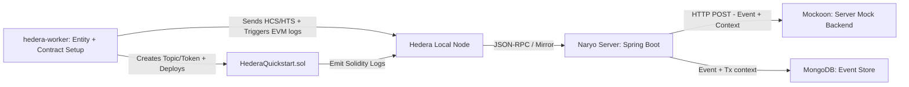

# Naryo Quickstart with Hedera (Hiero)

This guide shows how to configure and run Naryo against a local Hedera dev network to capture:

-   **Hedera Consensus Service (HCS)** messages
-   **Hedera Token Service (HTS)** transactions
-   **EVM Smart Contract** events (via the JSON-RPC relay)

## Requirements

*   Docker & Docker Compose
*   Git
*   Node.js (for the Hedera Local Node CLI)

## Step 1: Start a Local Hedera Network

Use the Hedera Local Node CLI (Hiero) to spin up a full local environment with Consensus Node, Mirror Node, and JSON‑RPC relay:

```bash
npm install @hashgraph/hedera-local -g
hedera start
```

> This command starts the required Hedera services in Docker. Keep it running while you use this quickstart.

## Step 2: Deploy the Hedera Quickstart Stack

Clone the Naryo repository and bring up the Hedera quickstart environment:

```bash
git clone https://github.com/LF-Decentralized-Trust-labs/Naryo naryo
cd naryo/examples/hedera-quickstart
docker compose up -d --build hedera-worker mock-http mongodb naryo-server
```

This command deploys the following components:

*   **Hedera Local Node**: Managed by the Hiero CLI you started in Step 1.
*   **`hedera-worker` container**:
    *   Creates a native HCS Topic and an HTS Token.
    *   Deploys a Solidity smart contract `HederaQuickstart.sol`.
    *   Periodically sends HCS messages, performs HTS actions, and triggers EVM logs.
*   **Mockoon Server**: Simulates a backend application that receives outgoing events from Naryo via HTTP.
*   **MongoDB Database**: Used to persist captured data.
*   **Naryo Server**: Monitors Hedera (native HCS/HTS + EVM events) and broadcasts/stores captured events.

> When using the reference Docker image of the Naryo server, you configure Naryo through an `application.yml`. You can also configure Naryo dynamically from a database (e.g., [MongoDB](../configuration/persistence/configuration-mongo.md) or [JPA-supported database](../configuration/persistence/configuration-jpa.md)) or manage it via the [Configuration API](../configuration/api/configuration-api.md).

For a detailed look at the configuration, inspect the [`application.yml`](../../examples/hedera-quickstart/application.yml) file used in this quickstart. Key sections include:

*   **Node Connection**: Defines how Naryo connects to the Hedera JSON‑RPC relay.
*   **Broadcasting Setup**: Configures the Mockoon HTTP server as an event destination.
*   **Event Filters**: Specifies how Naryo captures both EVM contract events and native HCS/HTS transactions. Note the use of `identifierType: IDENTITY_ID` for native Hedera transaction filters.

```yaml
naryo:
  nodes:
    - id: a1b2c3d4-e5f6-4a5b-8c9d-0e1f2a3b4c5d
      name: hedera
      type: HEDERA
      connection:
        type: HTTP
        endpoint:
          url: http://hedera-json-rpc-relay:7546
      subscription:
        method: POLL
        interval: 1s

  broadcasting:
    configuration:
      - id: 019d0b14-40f8-7c2c-837c-b3f69652a06e
        type: HTTP
        endpoint:
          url: http://mock-http:7070
    broadcasters:
      - id: 019d0b14-40f8-70fc-8b25-3759ad97114b
        configurationId: 019d0b14-40f8-7c2c-837c-b3f69652a06e
        target:
          type: FILTER
          filterId: b2c3d4e5-f6a7-4b5c-8d9e-0f1a2b3c4d5e
          destinations:
            - /events

  filters:
    # Contract event filter example
    - id: b2c3d4e5-f6a7-4b5c-8d9e-0f1a2b3c4d5e
      name: "hedera-contract-events"
      nodeId: a1b2c3d4-e5f6-4a5b-8c9d-0e1f2a3b4c5d
      type: "EVENT"
      scope: "CONTRACT"
      specification:
        signature: "HCSMessage(address,string)" # example of a contract log signature
      address: ${CONTRACT_ADDRESS}

    # Native transaction filter example (HCS/HTS by entity id)
    - id: 019d0b13-f41a-70c4-bd5b-d3d6e840921c
      name: "hedera-native-tx"
      nodeId: a1b2c3d4-e5f6-4a5b-8c9d-0e1f2a3b4c5d
      type: "TRANSACTION"
      identifierType: IDENTITY_ID
      value: ${TOKEN_ID}
```

> In your projects, replace values in the `.yml` with your own context (e.g., your RPC URL, your destination endpoints,
> your entity IDs, etc.).



## Step 3: Observe the Events

1.  **Monitor Mockoon Logs**: Open a new terminal to see the events Naryo posts to your mock backend:

    ```bash
    docker logs -ft mock-http
    ```

2.  **Monitor Hedera Worker and Naryo Logs**: In another terminal, follow the worker and Naryo logs to observe activity:

    ```bash
    docker compose logs -f hedera-worker naryo-server
    ```

You should see periodic requests being posted by Naryo to the Mockoon server. These will contain event payloads and transaction context for:

*   Contract logs decoded from the EVM relay
*   Native HCS/HTS transactions captured via entity filters

You can also inspect persisted data in MongoDB:

```bash
docker exec -it mongodb mongosh naryo --eval "db['contract-events'].find().pretty()"
docker exec -it mongodb mongosh naryo --eval "db['transactions'].find().pretty()"
```

## Conclusion and Next Steps

Congratulations! You've successfully deployed Naryo with a local Hedera network and observed its ability to monitor both native (HCS/HTS) and EVM layers.

Ready for more?

*   **[Naryo Configuration Guide](../../configuration/index.md)**: Learn the Naryo configuration model in detail.
*   **[Explore More Examples](../../examples/)**: Our `examples` folder contains various Naryo configurations, demonstrating usage with different databases, multiple nodes, fine-tuned performance, and more.
*   **[Naryo Quickstart with Ethereum](./naryo_quickstart.md)**: Explore Naryo's capabilities with Ethereum.
*   **[Besu Advanced Setup](./start_naryo_with_besu.md)**: Detailed guide for setting up Naryo with a Besu node.
